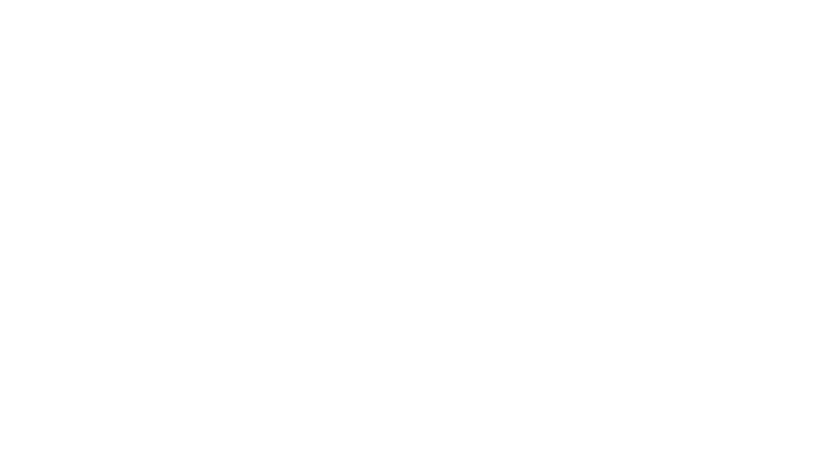

  

  Motion-first React components powered by Framer Motion + Tailwind. 
  Beautiful, production-ready UI elements for landing pages, dashboards, and modern apps.

  ⭐ <strong>Stars</strong> • MIT License

---

## 📘 Documentation
👉 Revealing Soon...

## 👋 About
Motion-first React components — powered by Framer Motion + Tailwind.
Premium, production-ready components designed to level up landing pages, SaaS dashboards, and modern web apps.

## ⭐ Key Features

- Motion-first components (smooth, fluid, modern)
- Beautifully designed UI patterns
- Fully customizable with Tailwind
- Zero external dependencies
- Dark-mode ready
- Copy–paste friendly
- Growing library (new components weekly)

## 🧩 Categories

- Backgrounds
- Hero Sections
- Sections
- Components
- Text Motion

## 🚀 Install (Coming Soon)

ReactVibe will ship as an NPM package after launch.
For now, use the components as described in the documentation.

## 🛠 Tech

- Next.js 15
- Framer Motion
- Tailwind CSS
- TypeScript

## ⭐ Support

If you like ReactVibe:
👉 Star the repo — it helps a lot.

## 🤝 Contribute
Contributions are welcome. Open an issue or PR.

📜 License
MIT License.
